# Проєктування версії v1.0

Документ пояснює UML-моделі v1.0 системи організації подій і проєктні рішення, прийняті на їх основі. Вимоги наведено в [requirements.md](requirements.md), специфікації сценаріїв у [use-cases.md](use-cases.md), простежуваність у [traceability.md](traceability.md).

## Діаграма варіантів використання

Діаграма відповідає на питання: хто взаємодіє із системою у межах v1.0 і яких цілей досягає. На ній потрібно побачити межу системи «Система організації подій», двох акторів і дев'ять варіантів використання.

Пов'язані вимоги: FR-01…FR-12.

**Актори.** Учасник виконує базові дії: реєстрація, вхід, перегляд події, приєднання, реєстрація витрат і перегляд балансу. Організатор є узагальненням Учасника: він виконує все те саме, а також створює й редагує подію та розподіляє витрати.

| Use Case | Актор | Вимоги |
|---|---|---|
| UC-01 Зареєструватися | Учасник | FR-01, FR-02 |
| UC-02 Увійти до системи | Учасник | FR-01, FR-02 |
| UC-03 Переглянути подію | Учасник | FR-05, FR-08 |
| UC-04 Приєднатися до події | Учасник | FR-07 |
| UC-05 Зареєструвати витрату | Учасник | FR-09, FR-10 |
| UC-06 Переглянути баланс | Учасник | FR-12 |
| UC-07 Створити подію | Організатор | FR-03, FR-04 |
| UC-08 Редагувати подію | Організатор | FR-04, FR-06 |
| UC-09 Розподілити витрату | Організатор | FR-11 |

## Activity Diagram

Activity Diagram деталізує перебіг сценарію: послідовність дій, точки рішення та альтернативні завершення. Кожен учасник команди побудував діаграму для свого Use Case. Код діаграм у форматі Mermaid зберігається в каталозі `model/` і версіонується разом з документацією.

| Use Case | Що показує діаграма | Вимоги | Діаграма |
|---|---|---|---|
| UC-02 Увійти до системи | Перевірку полів і перевірку облікових даних, два помилкові завершення | FR-01, FR-02 | [activity-uc-02.md](../model/activity-uc-02.md) |
| UC-05 Зареєструвати витрату | Перевірку суми та скасування дії | FR-09, FR-10 | [activity-uc-05.md](../model/activity-uc-05.md) |
| UC-07 Створити подію | Послідовну перевірку назви та дати | FR-03, FR-04 | [activity-uc-07.md](../model/activity-uc-07.md) |
| UC-09 Розподілити витрату | Перевірку вибору учасників і суми часток | FR-11, NFR-02 | [activity-uc-09.md](../model/activity-uc-09.md) |

## Діаграма класів

Діаграма відповідає на питання: які предметні сутності потрібні для v1.0 і як вони пов'язані. На ній потрібно побачити, що роль користувача (Організатор чи Учасник) зберігається в класі `Participation`, а не в `User`, і що витрата розподіляється на частки.

Пов'язані вимоги: FR-01, FR-03, FR-07–FR-12, NFR-02, NFR-05.

### Пояснення сутностей

- **User** — зареєстрований користувач (FR-01, FR-02). Пароль зберігається лише як хеш (NFR-05).
- **Event** — подія з назвою, датою, місцем і описом (FR-03–FR-06). `InviteCode` потрібен для посилання-запрошення (FR-07).
- **Participation** — участь користувача в конкретній події. Тут зберігається роль, бо один користувач може бути Організатором в одній події та Учасником в іншій. Створювач події отримує роль `Organizer` (FR-03, FR-08).
- **Expense** — спільна витрата: сума, опис і платник (FR-09, FR-10).
- **ExpenseShare** — частка однієї витрати, що припадає на одного учасника (FR-11). Зв'язок композиції означає, що частка не існує без витрати.
- **ParticipantRole** — перелік ролей: `Organizer`, `Participant`.
- **Баланси** (FR-12) окремо не зберігаються. `Event.GetBalances()` обчислює їх як «сплачено мінус сума власних часток».

Терміни SRS і Use Case відповідають моделі так: «Учасник» — це `Participation` із будь-якою роллю, «Організатор» — `Participation` з `Role = Organizer`.

### Обмеження, які діаграма не показує

- Пара (User, Event) унікальна: користувач не може приєднатися до однієї події двічі.
- У кожній події рівно один Організатор.
- Платник витрати та всі учасники часток належать тій самій події, що й витрата.
- Сума `ExpenseShare.Amount` по витраті дорівнює `Expense.Amount` з точністю до 0,01 грн (AC-11, NFR-02).

## State Machine Diagram

Для v1.0 State Machine Diagram не будується. Жоден об'єкт моделі не має життєвого циклу, у якому дозволена поведінка залежить від стану: подія, витрата та участь створюються i редагуються за тими самими правилами, а їхні атрибути такі як дата, сума, роль є даними, а не станами. Наприклад, перевірка ‘дата не в минулому’ (FR-04) виконується лише в момент створення чи збереження змін і не вводить окремого стану «минула подія».
