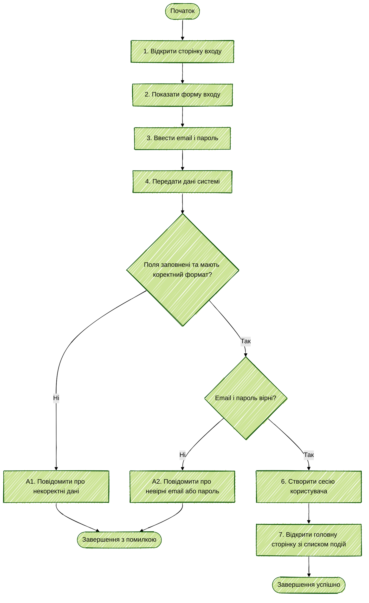

| Крок специфікації UC-02 | Елемент Activity Diagram |
|---|---|
| 1–3. Відкриття форми, введення та передавання даних | Послідовні дії на початку діаграми. |
| 4. Перевірка полів | Вузол рішення «Поля заповнені та коректні?»; гілка «Ні» веде до A1. |
| 5. Перевірка облікових даних | Вузол рішення «Email і пароль вірні?»; гілка «Ні» веде до A2. |
| 6–7. Створення сесії та перехід на головну | Успішна гілка після проходження обох перевірок. |
