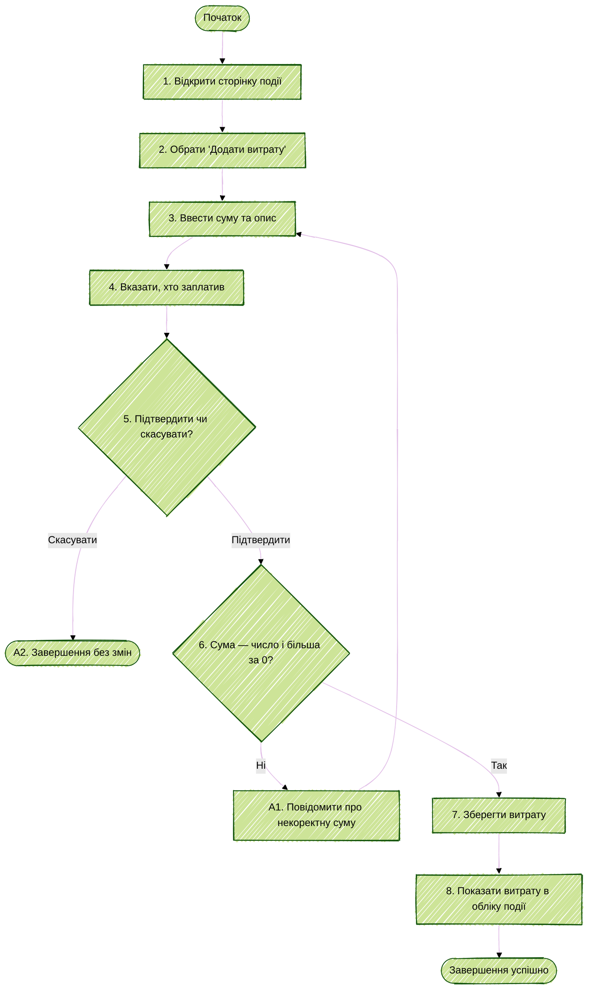

# Activity Diagram UC-05 «Зареєструвати витрату»

Діаграма показує, як учасник додає спільну витрату до події і де система може її відхилити: некоректна сума або скасування дії. Розподіл витрати між учасниками виконується окремо в UC-09. Пов'язані вимоги: FR-09, FR-10.

