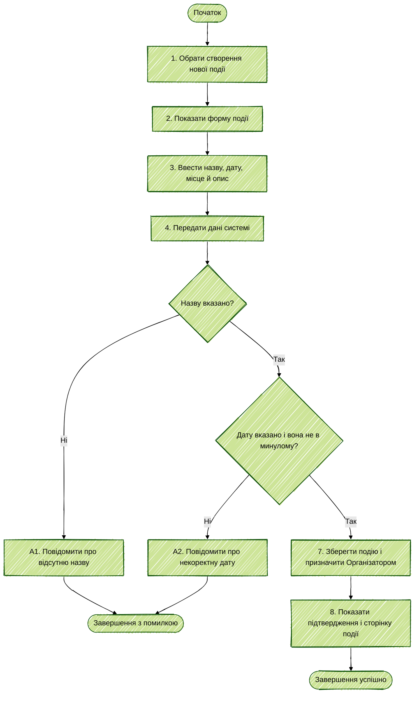

# Activity Diagram UC-07 «Створити подію»

Діаграма деталізує послідовність дій користувача та перевірок системи під час створення нової події, виділяючи дві гілки відхилення (A1, A2).

**Пов'язані вимоги:** FR-03, FR-04

| Крок специфікації UC-07 | Елемент Activity Diagram |
|---|---|
| 1–4. Вибір створення, показ форми, введення та передавання даних | Послідовні дії на початку діаграми. |
| 5. Перевірка назви | Вузол рішення «Назву вказано?»; гілка «Ні» веде до A1. |
| 6. Перевірка дати | Вузол рішення «Дату вказано і вона не в минулому?»; гілка «Ні» веде до A2. |
| 7–8. Збереження та підтвердження | Успішна гілка після проходження обох перевірок. |
