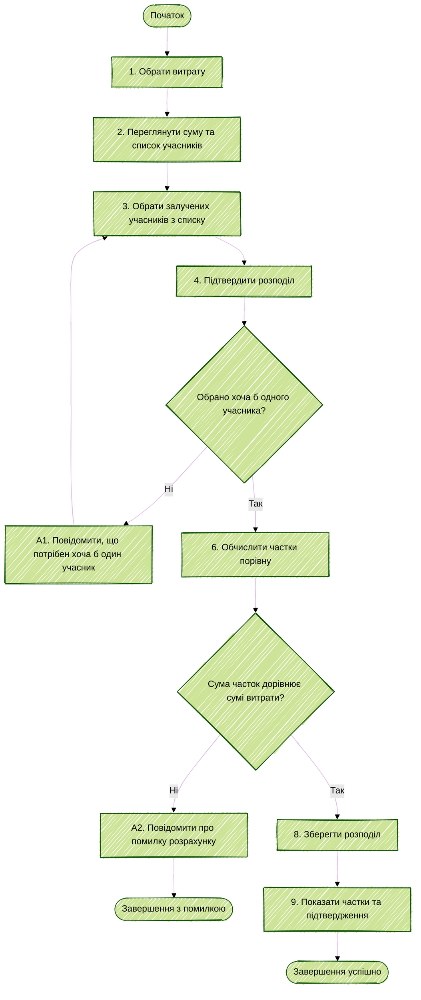

# Activity Diagram UC-09 «Розділити витрату»

| Крок специфікації UC-09 | Елемент Activity Diagram |
|---|---|
| 1–4. Вибір витрати, перегляд, вибір учасників, підтвердження | Послідовні дії на початку діаграми. |
| 5. Перевірка вибору учасників | Вузол рішення «Обрано хоча б одного учасника?»; гілка «Ні» веде до A1 і назад до вибору. |
| 6. Обчислення часток | Дія «Обчислити частки порівну». |
| 7. Перевірка суми | Вузол рішення «Сума часток дорівнює сумі витрати?»; гілка «Ні» веде до A2. |
| 8–9. Збереження та підтвердження | Успішна гілка після обох перевірок. |
